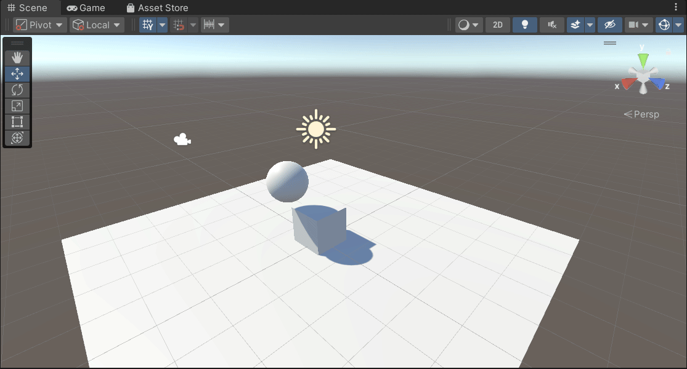
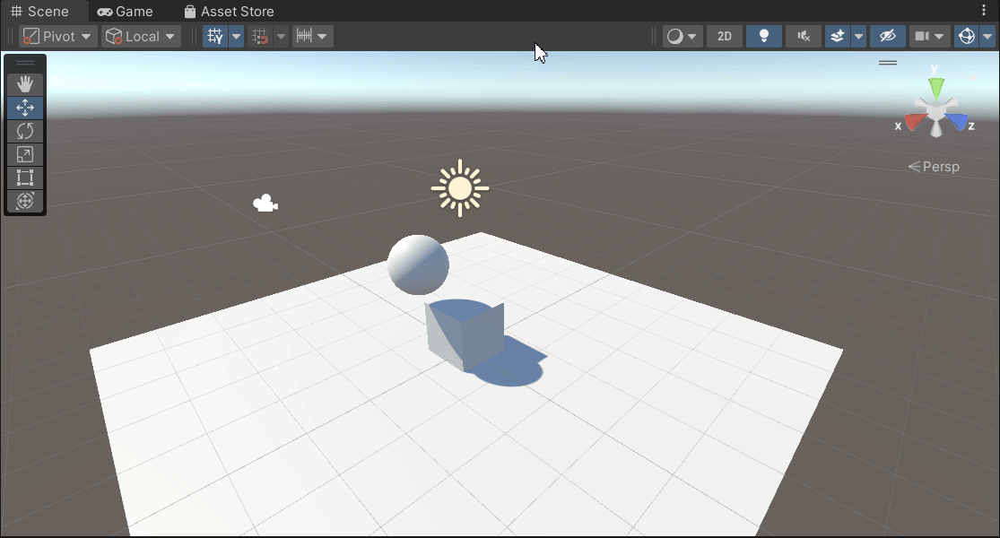
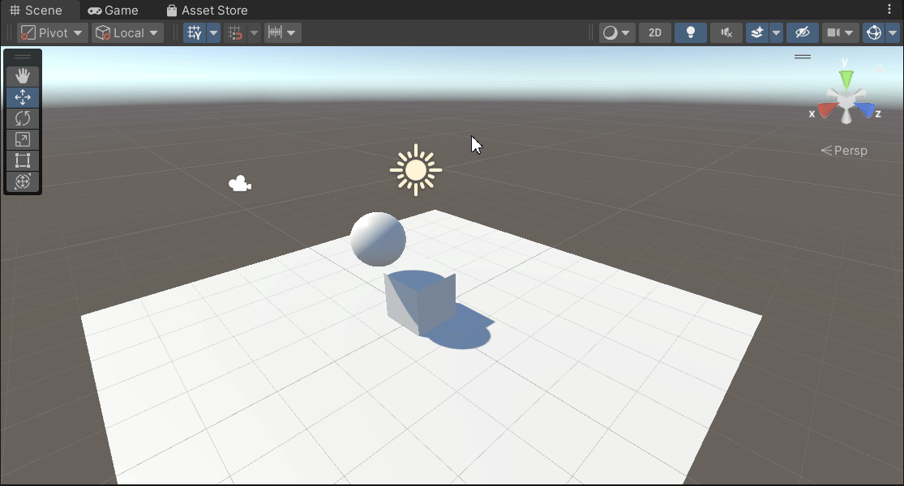

# Fisicas
## Situaciones
### Situación 1:
El plano no es un objeto físico. El cubo es un objeto físico y la esfera no. En este caso, el plano y la esfera sólo tendrán collider, mientras que el cubo debe tener Rigidbody. 

### Situación 2: 
El plano no es un objeto físico. El cubo es un objeto físico y la esfera también. En este caso, el plano sólo tendrán collider, mientras que el cubo y la esfera deben tener Rigidbody. 

### Situación 3:
El plano no es un objeto físico. El cubo es un objeto físico y la esfera es cinemática. En este caso, el plano sólo tendrán collider, mientras que el cubo y la esfera deben tener Rigidbody esta última cinemático. 

### Situación 4:
El plano es un objeto físico. El cubo es un objeto físico y la esfera es física. En este caso, todos los objetos deben tener Rigidbody. 

### Situación 5:
El plano es un objeto físico. El cubo es un objeto físico y la esfera es física con 10 veces más masa que el cubo. En este caso, todos los objetos deben tener Rigidbody.

### Situación 6:
El plano es un objeto físico. El cubo es un objeto físico y la esfera es física con 100 veces más masa que el cubo. En este caso, todos los objetos deben tener Rigidbody.

### Situación 7:
El plano es un objeto físico. El cubo es un objeto físico y la esfera es física con fricción. En este caso, todos los objetos deben tener Rigidbody.

### Situación 8:
El plano es un objeto físico. El cubo es un objeto físico y la esfera no es física y es Trigger. En este caso, todos los objetos deben tener Rigidbody.

### Situación 9:
El plano es un objeto físico. El cubo es un objeto físico y la esfera es física y es Trigger. En este caso, todos los objetos deben tener Rigidbody.

## Movimientos - Físicas
### 1. Agrega un campo velocidad a un cubo y asígnale un valor que se pueda cambiar en el inspector de objetos. Muestra la consola el resultado de multiplicar la velocidad por el valor del eje vertical y por el valor del eje horizontal cada vez que se pulsan las teclas flecha arriba-abajo ó flecha izquierda-derecha. El mensaje debe comenzar por el nombre de la flecha pulsada. 

### 2. Mapea la tecla H a la función disparo. 

### 3. Crea un script asociado al cubo que en cada iteración traslade al cubo una cantidad proporcional un vector que indica la dirección del movimiento: moveDirection que debe poder modificarse en el inspector.  La velocidad a la que se produce el movimiento también se especifica en el inspector, con la propiedad speed. Inicialmente la velocidad debe ser mayor que 1 y el cubo estar en una posición y=0. En el informe de la práctica comenta los resultados que obtienes en cada una de las siguientes situaciones:
- duplicas las coordenadas de la dirección del movimiento.
- duplicas la velocidad manteniendo la dirección del movimiento.
- la velocidad que usas es menor que 1
- la posición del cubo tiene y>0
- intercambiar movimiento relativo al sistema de referencia local y el mundial.

### 4. Mueve el cubo con las teclas de flecha arriba-abajo, izquierda-derecha a la velocidad speed. Cada uno de estos ejes implican desplazamientos en el eje vertical y horizontal respectivamente. Mueve la esfera con las teclas w-s (movimiento vertical) a-d (movimiento horizontal).

### 5. Adapta el movimiento en el ejercicio 5 para que el cubo se mueva hacia la posición de la esfera. Debes considerar, que el avance no debe estar influenciado por cuánto de lejos o cerca estén los dos objetos. 

### 6. Adapta el movimiento en el ejercicio 6 de forma que el cubo gire hacia la esfera. Realiza pruebas cambiando la posición de la esfera mediante las teclas awsd

### 7. Configura el cilindro como un objeto físico, cuando el cubo o la esfera colisionen con él se debe mostrar un mensaje en consola con la etiqueta del objeto que haya colisionado. 

### 8. Configura el cubo como un objeto cinemático y la esfera como un objeto físico. Adapta los scripts del ejercicio 9 para obtener el mismo comportamiento.

### 9. Configura el cilindro como un objeto de tipo Trigger. Adapta los scripts de los ejercicios anteriores para obtener el mismo comportamiento.

### 10. Agrega un cilindro de un color diferente al que ya hay en la escena y configúralo como un objeto físico. Selecciona un conjunto de teclas que te permitan controlar su movimiento por la escena y prográmale un movimiento que permita dirigirlo hacia la esfera. Prueba diferentes configuraciones de la esfera física con masa 10 veces mayor que el cilindro, física con masa 10 veces menor que el cilindro, cinemática y trigger. También prueba la configuración del cilindro de forma que su fricción se duplique o no. Explica en el informe todos los resultados posibles. 
